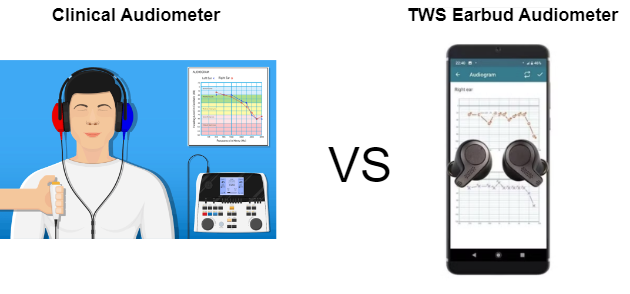
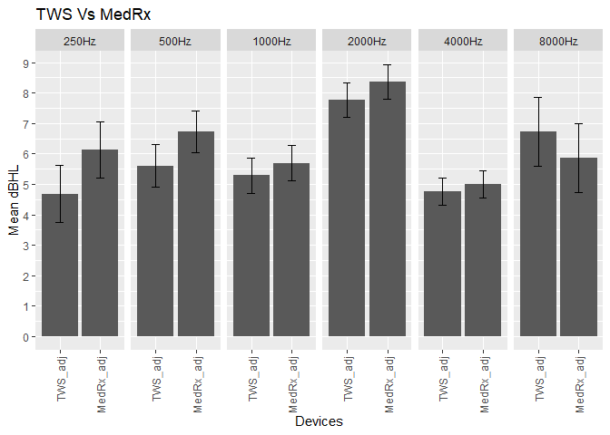

# Audiometer Analysis


## Table of Contents

[1. Introduction](#1-introduction)

[2. Research Questions](#2-research-questions)

[3. Data Source](#3-data-source)

[4. Data Preparation](#4-data-preparation)

[5. Descriptive Analysis](#5-descriptive-analysis)

[6. Exploratory Data Analysis](#6-exploratory-data-analysis)

  * [6.1 Analyzing the two groups of device measurements to find if there are any differences](#61-analyzing-the-two-groups-of-device-measurements-to-find-if-there-are-any-differences)

[7. Statistical Test: Paired-Samples T-test](#7-statistical-test-paired-samples-t-test)

[8. Summary and Conclusion](#8-summary-and-conclusion)

## 1. Introduction

Pure-tone audiometry (PTA) is the most commonly used test to measure a
person’s hearing threshold levels. The gold standard for measuring
hearing sensitivity is manual PTA which is typically performed by an
audiologist using a manual audiometer. There are normally two types of
manual audiometer out in the market:

1.  Portable audiometer: this is a standalone device that has an
    internal microprocessor to provide the audiometry functionality.

2.  PC-based audiometer: this usually consists of two main parts; the
    hardware unit conducting the testing and a usb connection to a PC
    that has an audiometry software included to run the test.

These traditional manual audiometers are expensive and requires a
specialist for calibration. In recent years, with technological
advancement driven by smartphones, true wireless stereo (TWS) earbuds
have become increasing popular due to their convenience and portability.
They also are able to offer a wide range of features such active noise
cancellation (ANC), fitness tracking, music playback, voice call, etc.
Therefore, it would make sense to use TWS earbuds for automated hearing
screening. In fact, there are already audio companies in the market that
provide these solutions such as [Nuheara](https://www.nuheara.com/) and [Apple AirPods Pro 2](https://support.apple.com/en-au/120991).

In this study, we investigate the reliability and accurateness between a
clinical audiometer (MedRx AVANT A2D+) and a pair of calibrated TWS
earbuds prototype that we have developed to have the functionality to
run an automated PTA through a mobile app.

Each participant underwent a total of four rounds of audiometry test
that consisted of two consecutive PTA assessments in each round. The
first PTA assessment used the [MedRx AVANT A2D+ audiometer](https://www.medrx-diagnostics.com/products/audiometers/avant-a2d) and the second
PTA assessment used our TWS earbuds prototype accompanied with an
android app as the interface. They were instructed to respond by
pressing a push button on the MedRx, or by pressing a button in the android app
on the TWS earbud whenever they heard a tone. The pure-tone signals were delivered to the ear at a variety of frequencies ranging
from 250 Hz to 8000 Hz which is the range necessary to understand
speech.

## 2. Research Questions

- For the range of tested frequencies, is there a statistically
  significant difference between the measurements in both devices?

## 3. Data Source

The data consisted of 12 male participants. Each of the participants
were subjected to 4 rounds of pure tone audiometry test with each round
consisting of:

1.  MedRx PTA measurements for both the left and right ear.
2.  TWS earbud PTA measurements for both the left and right ear.

All measurements were done in a sound booth and each of the rounds were
done on a different day.

The dataset includes:

1.  **audiometer_measurements.csv:** This file contains data of the
    hearing measurments for both MedRX and TWS earbud devices.
2.  **kemar_earbud_calibration.csv:** This file contains the calibration
    data to calibrate the output SPL for each frequency for the TWS
    earbud.

## 4. Data Preparation

Loading the packages:

``` r
library(ggplot2)
library(dplyr)
library(reshape) 
library(pastecs)
library(broom)
library(purrr)
library(this.path)
```

Importing the measurements data for both devices:

``` r
# Getting the path of your current open file
setwd(this.path::here())
setwd('../')
cwd <- getwd()
cwd <- getwd()
audiometer_df <- read.csv(file.path(cwd, 'datasource/audiometer_measurements.csv'))
head(audiometer_df)
```

    ##      Participant Gender Round     Device  Side F250Hz F500Hz F1000Hz F2000Hz F4000Hz F8000Hz
    ## 1 James Anderson      M     1 TWS earbud  Left     15     10       5       0    5      30
    ## 2 James Anderson      M     1 TWS earbud Right     15     10      10      15    5      20
    ## 3 James Anderson      M     1     Med RX  Left     15     15       5       5    5      15
    ## 4 James Anderson      M     1     Med RX Right     15     10      10      15    5      10
    ## 5    Liam Harris      M     1 TWS earbud  Left      5     10       5       5    10     25
    ## 6    Liam Harris      M     1 TWS earbud Right     10      5       0      10    0      25

Importing the calibration data for the TWS earbuds:

``` r
kemar_calibration_df <- read.csv(file.path(cwd, 'datasource/kemar_earbud_calibration.csv'))
head(kemar_calibration_df)
```

    ##   Frequency calibration_left calibration_right
    ## 1     250Hz              1.7               4.8
    ## 2     500Hz             -0.2               2.1
    ## 3    1000Hz              0.2               1.3
    ## 4    2000Hz              0.4               0.8
    ## 5    4000Hz             -2.8              -2.4
    ## 6    8000Hz              8.6              10.7

Converting device and sides into categorical variables:

``` r
audiometer_df$Device <- as.factor(audiometer_df$Device)
audiometer_df$Side <- as.factor(audiometer_df$Side)
```

In order to measure accurate hearing levels, the output of the earbuds
has to be calibrated to the correct dBSPL levels. Therefore, the
calibration data is applied to each of the frequencies for the TWS
earbuds for both the left and right side independently.

``` r
audiometer_cal_df <- audiometer_df

# Apply calibration to each freq bin for left side of earbud
audiometer_cal_df$F250Hz[audiometer_cal_df$Device=='TWS earbud' & audiometer_cal_df$Side =='Left'] <-
  audiometer_cal_df$F250Hz[audiometer_cal_df$Device=='TWS earbud' & audiometer_cal_df$Side=='Left'] - kemar_calibration_df$calibration_left[1]

audiometer_cal_df$F500Hz[audiometer_cal_df$Device=='TWS earbud' & audiometer_cal_df$Side =='Left'] <-
  audiometer_cal_df$F500Hz[audiometer_cal_df$Device=='TWS earbud' & audiometer_cal_df$Side=='Left'] - kemar_calibration_df$calibration_left[2]

audiometer_cal_df$F1000Hz[audiometer_cal_df$Device=='TWS earbud' & audiometer_cal_df$Side =='Left'] <-
  audiometer_cal_df$F1000Hz[audiometer_cal_df$Device=='TWS earbud' & audiometer_cal_df$Side=='Left'] - kemar_calibration_df$calibration_left[3]

audiometer_cal_df$F2000Hz[audiometer_cal_df$Device=='TWS earbud' & audiometer_cal_df$Side =='Left'] <-
  audiometer_cal_df$F2000Hz[audiometer_cal_df$Device=='TWS earbud' & audiometer_cal_df$Side=='Left'] - kemar_calibration_df$calibration_left[4]

audiometer_cal_df$F4000Hz[audiometer_cal_df$Device=='TWS earbud' & audiometer_cal_df$Side =='Left'] <-
  audiometer_cal_df$F4000Hz[audiometer_cal_df$Device=='TWS earbud' & audiometer_cal_df$Side=='Left'] - kemar_calibration_df$calibration_left[5]

audiometer_cal_df$F8000Hz[audiometer_cal_df$Device=='TWS earbud' & audiometer_cal_df$Side =='Left'] <-
  audiometer_cal_df$F8000Hz[audiometer_cal_df$Device=='TWS earbud' & audiometer_cal_df$Side=='Left'] - kemar_calibration_df$calibration_left[6]

# Apply calibration to each freq bin for right side of earbud
audiometer_cal_df$F250Hz[audiometer_cal_df$Device=='TWS earbud' & audiometer_cal_df$Side =='Right'] <-
  audiometer_cal_df$F250Hz[audiometer_cal_df$Device=='TWS earbud' & audiometer_cal_df$Side=='Right'] - kemar_calibration_df$calibration_right[1]

audiometer_cal_df$F500Hz[audiometer_cal_df$Device=='TWS earbud' & audiometer_cal_df$Side =='Right'] <-
  audiometer_cal_df$F500Hz[audiometer_cal_df$Device=='TWS earbud' & audiometer_cal_df$Side=='Right'] - kemar_calibration_df$calibration_right[2]

audiometer_cal_df$F1000Hz[audiometer_cal_df$Device=='TWS earbud' & audiometer_cal_df$Side =='Right'] <-
  audiometer_cal_df$F1000Hz[audiometer_cal_df$Device=='TWS earbud' & audiometer_cal_df$Side=='Right'] - kemar_calibration_df$calibration_right[3]

audiometer_cal_df$F2000Hz[audiometer_cal_df$Device=='TWS earbud' & audiometer_cal_df$Side =='Right'] <-
  audiometer_cal_df$F2000Hz[audiometer_cal_df$Device=='TWS earbud' & audiometer_cal_df$Side=='Right'] - kemar_calibration_df$calibration_right[4]

audiometer_cal_df$F4000Hz[audiometer_cal_df$Device=='TWS earbud' & audiometer_cal_df$Side =='Right'] <-
  audiometer_cal_df$F4000Hz[audiometer_cal_df$Device=='TWS earbud' & audiometer_cal_df$Side=='Right'] - kemar_calibration_df$calibration_right[5]

audiometer_cal_df$F8000Hz[audiometer_cal_df$Device=='TWS earbud' & audiometer_cal_df$Side =='Right'] <-
  audiometer_cal_df$F8000Hz[audiometer_cal_df$Device=='TWS earbud' & audiometer_cal_df$Side=='Right'] - kemar_calibration_df$calibration_right[6]

head(audiometer_cal_df)
```

    ##      Participant Gender Round     Device  Side F250Hz F500Hz F1000Hz F2000Hz F4000Hz F8000Hz 
    ## 1 James Anderson      M     1 TWS earbud  Left   13.3   10.2     4.8    -0.4   7.8     21.4
    ## 2 James Anderson      M     1 TWS earbud Right   10.2    7.9     8.7    14.2   7.4     9.3
    ## 3 James Anderson      M     1     Med RX  Left   15.0   15.0     5.0     5.0   5.0     15.0
    ## 4 James Anderson      M     1     Med RX Right   15.0   10.0    10.0    15.0   5.0     10.0
    ## 5    Liam Harris      M     1 TWS earbud  Left    3.3   10.2     4.8     4.6   12.8    16.4
    ## 6    Liam Harris      M     1 TWS earbud Right    5.2    2.9    -1.3     9.2   2.4     14.3

## 5. Descriptive Analysis

Lets get some basic descriptive statistics from the the two groups of
devices:

``` r
print(by(cbind(F250Hz=audiometer_cal_df$F250Hz, F500Hz=audiometer_cal_df$F500Hz,
               F1000Hz=audiometer_cal_df$F1000Hz, F2000Hz=audiometer_cal_df$F2000Hz,
               F4000Hz=audiometer_cal_df$F4000Hz, F8000Hz=audiometer_cal_df$F8000Hz),
         INDICES=audiometer_cal_df$Device,
         function(X) round(stat.desc(X), 2)))
```

    ## INDICES: Med RX
    ##              F250Hz F500Hz F1000Hz F2000Hz F4000Hz F8000Hz
    ## nbr.val       58.00  58.00   58.00   58.00   58.00   58.00
    ## nbr.null      12.00  10.00   18.00    5.00   12.00   13.00
    ## nbr.na         0.00   0.00    0.00    0.00    0.00    0.00
    ## min          -10.00  -5.00   -5.00   -5.00   -5.00  -10.00
    ## max           20.00  25.00   20.00   40.00   20.00   25.00
    ## range         30.00  30.00   25.00   45.00   25.00   35.00
    ## sum          355.00 390.00  330.00  485.00  290.00  340.00
    ## median         5.00   5.00    5.00    5.00    5.00    5.00
    ## mean           6.12   6.72    5.69    8.36    5.00    5.86
    ## SE.mean        0.83   0.81    0.76    1.13    0.99    1.19
    ## CI.mean.0.95   1.67   1.63    1.53    2.26    1.99    2.38
    ## var           40.39  38.20   33.73   74.02   57.02   81.70
    ## std.dev        6.36   6.18    5.81    8.60    7.55    9.04
    ## coef.var       1.04   0.92    1.02    1.03    1.51    1.54
    ## ------------------------------------------------------------ 
    ## INDICES: TWS earbud
    ##              F250Hz F500Hz F1000Hz F2000Hz F4000Hz F8000Hz
    ## nbr.val       58.00  58.00   58.00   58.00   58.00   58.00
    ## nbr.null       0.00   0.00    0.00    0.00    0.00    0.00
    ## nbr.na         0.00   0.00    0.00    0.00    0.00    0.00
    ## min           -6.70  -9.80   -6.30   -5.80  -12.60  -13.60
    ## max           25.20  27.90   18.70   34.20   22.80   21.40
    ## range         31.90  37.70   25.00   40.00   35.40   35.00
    ## sum          271.50 324.90  306.50  450.20  275.80  390.30
    ## median         3.30   5.20    4.80    9.20    2.80    6.40
    ## mean           4.68   5.60    5.28    7.76    4.76    6.73
    ## SE.mean        0.84   0.98    0.92    0.99    1.04    1.13
    ## CI.mean.0.95   1.69   1.95    1.85    1.98    2.08    2.26
    ## var           41.32  55.25   49.52   56.94   62.88   74.17
    ## std.dev        6.43   7.43    7.04    7.55    7.93    8.61
    ## coef.var       1.37   1.33    1.33    0.97    1.67    1.28

## 6. Exploratory data analysis

We will re-arrange the dataframe to prepare each frequency for a
repeated measures design:

``` r
# 250 Hz
df_250Hz = cbind(audiometer_cal_df[1:5], audiometer_cal_df[6])
tws_250Hz_df <- subset(df_250Hz, df_250Hz$Device == 'TWS earbud')
colnames(tws_250Hz_df)[6] <- "TWS"
medRx_250Hz_df <- subset(df_250Hz, df_250Hz$Device == 'Med RX')
df_250Hz <- data.frame(tws_250Hz_df, MedRx = medRx_250Hz_df$F250Hz )
df_250Hz$Frequency = "250Hz"
df_250Hz <- within(df_250Hz, rm("Round"))
df_250Hz <- within(df_250Hz, rm("Device"))

# 500 Hz
df_500Hz = cbind(audiometer_cal_df[1:5], audiometer_cal_df[7])
tws_500Hz_df <- subset(df_500Hz, df_500Hz$Device == 'TWS earbud')
colnames(tws_500Hz_df)[6] <- "TWS"
medRx_500Hz_df <- subset(df_500Hz, df_500Hz$Device == 'Med RX')
df_500Hz <- data.frame(tws_500Hz_df, MedRx = medRx_500Hz_df$F500Hz )
df_500Hz$Frequency = "500Hz"
df_500Hz <- within(df_500Hz, rm("Round"))
df_500Hz <- within(df_500Hz, rm("Device"))

# 1000 Hz
df_1000Hz = cbind(audiometer_cal_df[1:5], audiometer_cal_df[8])
tws_1000Hz_df <- subset(df_1000Hz, df_1000Hz$Device == 'TWS earbud')
colnames(tws_1000Hz_df)[6] <- "TWS"
medRx_1000Hz_df <- subset(df_1000Hz, df_1000Hz$Device == 'Med RX')
df_1000Hz <- data.frame(tws_1000Hz_df, MedRx = medRx_1000Hz_df$F1000Hz )
df_1000Hz$Frequency = "1000Hz"
df_1000Hz <- within(df_1000Hz, rm("Round"))
df_1000Hz <- within(df_1000Hz, rm("Device"))

# 2000 Hz
df_2000Hz = cbind(audiometer_cal_df[1:5], audiometer_cal_df[9])
tws_2000Hz_df <- subset(df_2000Hz, df_2000Hz$Device == 'TWS earbud')
colnames(tws_2000Hz_df)[6] <- "TWS"
medRx_2000Hz_df <- subset(df_2000Hz, df_2000Hz$Device == 'Med RX')
df_2000Hz <- data.frame(tws_2000Hz_df, MedRx = medRx_2000Hz_df$F2000Hz )
df_2000Hz$Frequency = "2000Hz"
df_2000Hz <- within(df_2000Hz, rm("Round"))
df_2000Hz <- within(df_2000Hz, rm("Device"))

# 4000 Hz
df_4000Hz = cbind(audiometer_cal_df[1:5], audiometer_cal_df[10])
tws_4000Hz_df <- subset(df_4000Hz, df_4000Hz$Device == 'TWS earbud')
colnames(tws_4000Hz_df)[6] <- "TWS"
medRx_4000Hz_df <- subset(df_4000Hz, df_4000Hz$Device == 'Med RX')
df_4000Hz <- data.frame(tws_4000Hz_df, MedRx = medRx_4000Hz_df$F4000Hz )
df_4000Hz$Frequency = "4000Hz"
df_4000Hz <- within(df_4000Hz, rm("Round"))
df_4000Hz <- within(df_4000Hz, rm("Device"))

# 8000 Hz
df_8000Hz = cbind(audiometer_cal_df[1:5], audiometer_cal_df[11])
tws_8000Hz_df <- subset(df_8000Hz, df_8000Hz$Device == 'TWS earbud')
colnames(tws_8000Hz_df)[6] <- "TWS"
medRx_8000Hz_df <- subset(df_8000Hz, df_8000Hz$Device == 'Med RX')
df_8000Hz <- data.frame(tws_8000Hz_df, MedRx = medRx_8000Hz_df$F8000Hz )
df_8000Hz$Frequency = "8000Hz"
df_8000Hz <- within(df_8000Hz, rm("Round"))
df_8000Hz <- within(df_8000Hz, rm("Device"))
```

## 6.1 Analyzing the two groups of device measurements to find if there are any differences

In this section, we will visualize the device measurement differences
using error bars. To eliminate any between-subject differences in plotting the error bars 
for a repeated measure design, we will have to adjust the mean of the data so that the average
of both the MedRx and TWS earbud are the same for each participant.

``` r
df_250Hz$pMean <- (df_250Hz$TWS + df_250Hz$MedRx)/2
grandMean_250Hz <- mean(c(df_250Hz$TWS, df_250Hz$MedRx))
df_250Hz$adj <- grandMean_250Hz - df_250Hz$pMean
df_250Hz$TWS_adj <- df_250Hz$TWS + df_250Hz$adj
df_250Hz$MedRx_adj <- df_250Hz$MedRx + df_250Hz$adj

df_500Hz$pMean <- (df_500Hz$TWS + df_500Hz$MedRx)/2
grandMean_500Hz <- mean(c(df_500Hz$TWS, df_500Hz$MedRx))
df_500Hz$adj <- grandMean_500Hz - df_500Hz$pMean
df_500Hz$TWS_adj <- df_500Hz$TWS + df_500Hz$adj
df_500Hz$MedRx_adj <- df_500Hz$MedRx + df_500Hz$adj

df_1000Hz$pMean <- (df_1000Hz$TWS + df_1000Hz$MedRx)/2
grandMean_1000Hz <- mean(c(df_1000Hz$TWS, df_1000Hz$MedRx))
df_1000Hz$adj <- grandMean_1000Hz - df_1000Hz$pMean
df_1000Hz$TWS_adj <- df_1000Hz$TWS + df_1000Hz$adj
df_1000Hz$MedRx_adj <- df_1000Hz$MedRx + df_1000Hz$adj

df_2000Hz$pMean <- (df_2000Hz$TWS + df_2000Hz$MedRx)/2
grandMean_2000Hz <- mean(c(df_2000Hz$TWS, df_2000Hz$MedRx))
df_2000Hz$adj <- grandMean_2000Hz - df_2000Hz$pMean
df_2000Hz$TWS_adj <- df_2000Hz$TWS + df_2000Hz$adj
df_2000Hz$MedRx_adj <- df_2000Hz$MedRx + df_2000Hz$adj

df_4000Hz$pMean <- (df_4000Hz$TWS + df_4000Hz$MedRx)/2
grandMean_4000Hz <- mean(c(df_4000Hz$TWS, df_4000Hz$MedRx))
df_4000Hz$adj <- grandMean_4000Hz - df_4000Hz$pMean
df_4000Hz$TWS_adj <- df_4000Hz$TWS + df_4000Hz$adj
df_4000Hz$MedRx_adj <- df_4000Hz$MedRx + df_4000Hz$adj

df_8000Hz$pMean <- (df_8000Hz$TWS + df_8000Hz$MedRx)/2
grandMean_8000Hz <- mean(c(df_8000Hz$TWS, df_8000Hz$MedRx))
df_8000Hz$adj <- grandMean_8000Hz - df_8000Hz$pMean
df_8000Hz$TWS_adj <- df_8000Hz$TWS + df_8000Hz$adj
df_8000Hz$MedRx_adj <- df_8000Hz$MedRx + df_8000Hz$adj

df_new <- rbind(df_250Hz, df_500Hz, df_1000Hz, df_2000Hz, df_4000Hz, df_8000Hz)
head(df_new)
```

    ##       Participant Gender  Side  TWS MedRx Frequency pMean       adj  TWS_adj MedRx_adj
    ## 1  James Anderson      M  Left 13.3    15     250Hz 14.15 -8.749138 4.550862 6.250862    
    ## 2  James Anderson      M Right 10.2    15     250Hz 12.60 -7.199138 3.000862 7.800862
    ## 5     Liam Harris      M  Left  3.3     5     250Hz  4.15  1.250862 4.550862 6.250862
    ## 6     Liam Harris      M Right  5.2    10     250Hz  7.60 -2.199138 3.000862 7.800862
    ## 9       Noah King      M  Left -6.7   -10     250Hz -8.35 13.750862 7.050862 3.750862
    ## 10      Noah King      M Right -4.8    -5     250Hz -4.90 10.300862 5.500862 5.300862

Now convert new dataframe to long format and plot the error bar graph
between the two device measurements:

``` r
#Categorize
df_new$Frequency <-factor(df_new$Frequency, levels=c('250Hz', '500Hz', '1000Hz', '2000Hz', '4000Hz', '8000Hz'))

df_new_melt <- melt(df_new, id = c("Participant", "Gender", "Side", "TWS", "MedRx", "Frequency", "pMean", "adj"),
                    measured = c("TWS_adj", "MedRx_adj"))


bar <- ggplot(df_new_melt, aes(variable, value) ) + stat_summary(fun = mean, geom = "bar", position = "dodge") +
  stat_summary(fun.data = mean_cl_normal, geom = "errorbar", position = position_dodge(width=0.90), width = 0.2) +
  facet_wrap(~Frequency, ncol = 6) +
  theme(axis.text.x = element_text(angle = 90, vjust = 0.5, hjust=1)) +
  labs(x = "Devices", y = "Mean dBHL", fill = "Side") +
  scale_y_continuous(breaks = seq(0, 10, len = 11)) +
  ggtitle("TWS Vs MedRx")

print(bar)
```

<!-- -->

#### - Discussion of Results

The error bars from each frequency measurement overlap between both
devices. This tells us that there could be a possibility that the means
come from the same population and therefore the measurements from both
devices are not statistically different. We will try to quantify this by
conducting a statistical t-test in the next section.

## 7. Statistical Test: Paired-Samples T-test

In this section, we will compare the mean dBHL of each frequency for the
MedRx and the TWS earbud to see if there are any significant differences
between the two devices. For this investigation, we will perform a
pair-wise t-test (repeated-measures design) on each frequency (i.e.,
250Hz, 500Hz, 1000Hz, 2000Hz, 4000Hz and 8000Hz).

Now perform dependent paired-wise t-test:

``` r
dep_ttest_F250Hz <- t.test(df_250Hz$TWS, df_250Hz$MedRx, paired = TRUE)
dep_ttest_F500Hz <- t.test(df_500Hz$TWS, df_500Hz$MedRx, paired = TRUE)
dep_ttest_F1000Hz <- t.test(df_1000Hz$TWS, df_1000Hz$MedRx, paired = TRUE)
dep_ttest_F2000Hz <- t.test(df_2000Hz$TWS, df_2000Hz$MedRx, paired = TRUE)
dep_ttest_F4000Hz <- t.test(df_4000Hz$TWS, df_4000Hz$MedRx, paired = TRUE)
dep_ttest_F8000Hz <- t.test(df_8000Hz$TWS, df_8000Hz$MedRx, paired = TRUE)

tab <- map_df(list(dep_ttest_F250Hz, dep_ttest_F500Hz, dep_ttest_F1000Hz, dep_ttest_F2000Hz,
                   dep_ttest_F4000Hz, dep_ttest_F8000Hz), tidy)
freq <- c("250Hz", "500Hz", "1000Hz", "2000Hz", "4000Hz", "8000Hz")


tab <- data.frame(freq, tab[c("estimate", "statistic", "p.value", "conf.low", "conf.high")])
colnames(tab)[2] <- "mean.diff"
colnames(tab)[3] <- "t.statistic"

tab[, (2:3)] <- round(tab[, (2:3)], digits=1)
tab[, (5:6)] <- round(tab[, (5:6)], digits=1)
tab[, 4] <- round(tab[, 4], digits=5)
print(tab)
```

    ##     freq mean.diff t.statistic p.value conf.low conf.high
    ## 1  250Hz      -1.4        -1.6 0.12601     -3.3       0.4
    ## 2  500Hz      -1.1        -1.6 0.11163     -2.5       0.3
    ## 3 1000Hz      -0.4        -0.7 0.48639     -1.6       0.8
    ## 4 2000Hz      -0.6        -1.1 0.29610     -1.7       0.5
    ## 5 4000Hz      -0.2        -0.6 0.57708     -1.1       0.6
    ## 6 8000Hz       0.9         0.8 0.44446     -1.4       3.1

#### - Discussion of Results

The hypothesis of a paired t-test is as follows:

- The null hypothesis - the means in the two groups (MedRx Vs TWS) are
  equal.
- The alternative hypothesis - the means in the two groups (MedRx vs
  TWS) are not equal.

Since the results of the p-values in all frequencies are \> 0.05 for the
paired-wise t-test conducted, the null hypothesis is not rejected and we
can conclude that the two population means are equal. Therefore, there
were no statistically differences between test for the MedRx and TWS
earbud indicating that the TWS earbud gave results consistent with those
from a clinical PTA.

## 8. Summary and Conclusion
This study showed the reliability and accurateness in performing a hearing test between a clinical audiometer and a pair of calibrated TWS earbuds. 
From our tests conducted, there were no significance difference in measurements between the devices. However, our sample size was small with only 12 participants and all of them being male.
Therefore, in future studies, we plan to verify our findings by gathering more participants and having a more equal representation of male and females.

