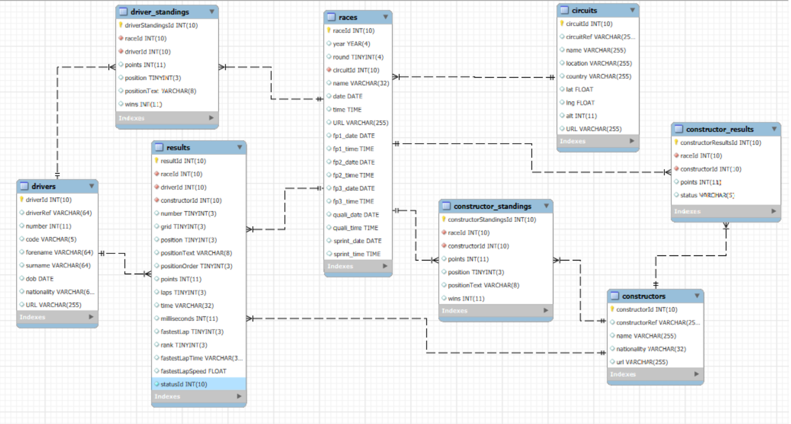

# Formula1 Analysis (1950 - 2024)
 

## Table of Contents
- [1. Introduction](#1-introduction)

- [2. Data Source](#2-data-source)

- [3. Import Data Into SQL](#3-import-data-into-sql)
	* [3.1 Database Schema](#31-database-schema)

- [4. Data Cleaning](#4-data-cleaning)

- [5. Exploratory Data Analysis](#5-exploratory-data-analysis)
	* [5.1 Find the Top 10 drivers of All Time By Wins and Championships](#51-find-the-top-10-drivers-of-all-time-by-wins-and-championships)
	* [5.2 Find the Top 10 Drivers Ranking Positions Over the Years](#52-find-the-top-10-drivers-ranking-positions-over-the-years) 
	* [5.3 Find the Top 10 Constructor By Constructors Championship](#53-find-the-top-10-constructor-by-constrcutors-championship) 
	* [5.4 Find Each Circuit Fastest Lap Time](#54-find-each-circuit-fastest-lap-time)

- [6. Tableau Dashboards](#6-tableau-dashboards)

- [7. Summary](#7-summary)

## 1. Introduction
<p align = "justify">
Formula 1 (F1) is a prestigious international motor racing competition and the highest class of open-wheel single-seater racing watched by millions of fans all around the world. The races involve drivers competing for the F1 driver's championship and teams competing for the F1 constructor's championship. A Formula One season consists of a series of races, known as Grands Prix, which take place in various countries and continents on both purpose-built circuits and closed public roads. The first F1 world championship started in 1950 at Silverstone in the United Kingdom. Since then, a total of 35 different drivers and 15 constructors have been crowned world champions. In addition, 15 drivers have managed to win the title of world champion more than once.
</p>

<p align = "justify">
In this study, we are going to store the data related to drivers, teams, circuits, cars, lap-times, etc into a relational database management system (RDMS). We will then perform exploratory analysis on the underlying data using SQL queries to answers certain question such as:

1. The top 10 drivers of all-time
2. The top 10 constructors of all-time
3. Driver's standing positions over the years of the top 10 drivers of all-time.
4. The fastest lap-times at every circuit

</p>


<p align = "justify">
Finally, we will report our findings through visualizations in tableau dashboards.
</p>

## 2. Data Source
The dataset used in this project is available at: https://www.kaggle.com/datasets/rohanrao/formula-1-world-championship-1950-2020/data.
It has 14 CSV files that contains all information on the formula 1 races from 1950 - 2024. Below is a brief summary of the files:

| File Name | Description |
| --- | --- |
| circuits.csv | Contains information of circuits and locations where F1 races were held |
| constructor_results.csv | Contains race results of the constructor's championship |
| constructor_standings.csv | Contains final standings of the constructor's championship |
| constructors.csv | Contains F1 team names in the constructors | 
| driver_standings.csv | Contains final standings of the driver's championship |
| drivers.csv | Contains information of the F1 drivers |
| lap_times.csv | Contains the lap times of the driver in each race |
| pit_stops.csv | Contains information of the pit stops timing and duration of each race |
| qualifying.csv | Contains information of the qualifying rounds in each race |
| races.csv | Contains information of the track races |
| results.csv | Contains the results of each race |
| seasons.csv | Contains the seasons of F1 |
| sprint_results.csv | Contains results of the sprint races |
| status.csv | Contains the mapping of various statuses  |


## 3. Import Data Into SQL
We created tables in SQL and import the data from the csv files into these tables.
When importing the data, converting **_mm:ss:ms_** format to **time** datatype had issues as it floors the **_ms_** part to zero. 
Therefore, we had to convert the mm:ss:ms format to a **VARCHAR** to have the mm:ss:ms properly imported. We will fix this up in the next section when cleaning the data. 

``` sql
/* Create Formula 1 database */

-- Create database
DROP DATABASE IF EXISTS formula1;
CREATE DATABASE formula1;
USE formula1;

-- Create circuits table
DROP TABLE IF EXISTS circuits;
CREATE TABLE circuits (
    circuitId INT UNSIGNED NOT NULL PRIMARY KEY,
	circuitRef VARCHAR(255),
    name VARCHAR(255),
    location VARCHAR(255),
    country VARCHAR(255),
    lat FLOAT,
    lng FLOAT,
    alt INT,
    URL VARCHAR(255)
);

-- CREATE races table
DROP TABLE IF EXISTS races;
CREATE TABLE races (
	raceId INT UNSIGNED NOT NULL PRIMARY KEY,
	year YEAR,
	round TINYINT,
	circuitId INT UNSIGNED NOT NULL,
	name VARCHAR(32),
	date DATE,
	time TIME,
	URL VARCHAR(255),
	fp1_date DATE,
	fp1_time TIME,
	fp2_date DATE,
	fp2_time TIME,
	fp3_date DATE,
	fp3_time TIME,
	quali_date DATE,
	quali_time TIME,
	sprint_date DATE,
	sprint_time TIME,
	FOREIGN KEY (circuitId) REFERENCES circuits(circuitId)
);

-- Create constructors table
DROP TABLE IF EXISTS constructors;
CREATE TABLE constructors (
	constructorId INT UNSIGNED NOT NULL PRIMARY KEY,
	constructorRef VARCHAR(255),
	name VARCHAR(255),
	nationality VARCHAR(32),
	url VARCHAR(255)
);

-- Create constructor_results table
DROP TABLE IF EXISTS constructor_results;
CREATE TABLE constructor_results (
	constructorResultsId INT UNSIGNED NOT NULL PRIMARY KEY,
	raceId INT UNSIGNED NOT NULL,
	constructorId INT UNSIGNED NOT NULL,
	FOREIGN KEY (raceId) REFERENCES races (raceId),
	FOREIGN KEY (constructorId) REFERENCES constructors (constructorId),
	points INT,
	status VARCHAR(5)
);

-- Create constructor_standings table
DROP TABLE IF EXISTS constructor_standings;
CREATE TABLE constructor_standings (
	constructorStandingsId INT UNSIGNED NOT NULL PRIMARY KEY,
	raceId INT UNSIGNED NOT NULL,
	constructorId INT UNSIGNED NOT NULL,
	FOREIGN KEY (raceId) REFERENCES races (raceId),
	FOREIGN KEY (constructorId) REFERENCES constructors (constructorId),
	points INT,
	position TINYINT UNSIGNED,
	positionText VARCHAR(8),
	wins INT
);

-- Create drivers table
DROP TABLE IF EXISTS drivers;
CREATE TABLE drivers (
	driverId INT UNSIGNED NOT NULL PRIMARY KEY,
	driverRef VARCHAR(64),
	number INT,
	code VARCHAR(5),
	forename VARCHAR(64),
	surname  VARCHAR(64),
	dob DATE,
	nationality VARCHAR(64),
	URL VARCHAR(255)
);

-- Create driver_standings table
DROP TABLE IF EXISTS driver_standings;
CREATE TABLE driver_standings (
	driverStandingsId INT UNSIGNED NOT NULL PRIMARY KEY,
	raceId INT UNSIGNED NOT NULL, 
	driverId INT UNSIGNED NOT NULL,
	points INT,
	position TINYINT UNSIGNED,
	positionText VARCHAR(8),
	wins INT,
	FOREIGN KEY (raceId) REFERENCES races(raceId),
	FOREIGN KEY (driverId) REFERENCES drivers(driverId)
);

-- Create lap_times table
DROP TABLE IF EXISTS lap_times; 
CREATE TABLE lap_times (
	raceId INT UNSIGNED NOT NULL,
	driverId INT UNSIGNED NOT NULL,
	lap TINYINT UNSIGNED, 
	position TINYINT UNSIGNED,
	-- time TIME,
	-- Note: modify time a string as there is
	-- a formatting error with some of the inputs 
	time VARCHAR(32),
	milliseconds INT UNSIGNED,
	FOREIGN KEY (raceId) REFERENCES races(raceId),
	FOREIGN KEY (driverId) REFERENCES drivers(driverId)
);

-- Create pit_stops table
DROP TABLE IF EXISTS pit_stops;
CREATE TABLE pit_stops (
	raceId INT UNSIGNED NOT NULL,
	driverId INT UNSIGNED NOT NULL,
	stop  TINYINT UNSIGNED,
	lap TINYINT UNSIGNED,
	time TIME,
	duration FLOAT,
	milliseconds BIGINT UNSIGNED,
	FOREIGN KEY (raceId) REFERENCES races(raceId),
	FOREIGN KEY (driverId) REFERENCES drivers(driverId)
);

-- Create qualifying table
-- Note: q2, q3 fields haves missing values and
-- is truncated to 00:00:00.
DROP TABLE IF EXISTS qualifying;
CREATE TABLE qualifying (
	qualifyId INT UNSIGNED NOT NULL PRIMARY KEY,
	raceId INT UNSIGNED NOT NULL,
	driverId INT UNSIGNED NOT NULL,
	constructorId INT UNSIGNED NOT NULL,
	number TINYINT UNSIGNED, 
	position TINYINT UNSIGNED,
	-- q1 TIME, 
	-- q2 TIME,
	-- q3 TIME,
	-- Note: modify q1, q2 & q3 to be a string as there is
	-- a formatting error with some of the inputs 
	q1 VARCHAR(32),
	q2 VARCHAR(32),
	q3 VARCHAR(32),
	FOREIGN KEY (raceId) REFERENCES races(raceId),
	FOREIGN KEY (driverId) REFERENCES drivers(driverId),
	FOREIGN KEY (constructorId) REFERENCES constructors(constructorId)
);

-- Create status table
DROP TABLE IF EXISTS status;
CREATE TABLE status (
	statusId INT UNSIGNED NOT NULL PRIMARY KEY,
	status VARCHAR(32)
); 

-- Create results table
DROP TABLE IF EXISTS results;
CREATE TABLE results (
	resultId INT UNSIGNED NOT NULL PRIMARY KEY,
	raceId INT UNSIGNED NOT NULL,
	driverId INT UNSIGNED NOT NULL,
	constructorId INT UNSIGNED NOT NULL,
	number TINYINT UNSIGNED,
	grid TINYINT UNSIGNED,
	position TINYINT UNSIGNED,
	positionText VARCHAR(8),
	positionOrder TINYINT UNSIGNED,
	points INT,
	laps TINYINT UNSIGNED,
	time VARCHAR(32),
	milliseconds INT SIGNED,
	fastestLap TINYINT UNSIGNED,
	rank TINYINT UNSIGNED,
	/*
	fastestLapTime TIME,
	-- Note: modify time to be a string as there is
	-- a formatting error with some of the inputs
	*/
	fastestLapTime VARCHAR(32),
	fastestLapSpeed FLOAT,
	statusId INT UNSIGNED NOT NULL,
	FOREIGN KEY (raceId) REFERENCES races(raceId),
	FOREIGN KEY (driverId) REFERENCES drivers(driverId),
	FOREIGN KEY (constructorId) REFERENCES constructors(constructorId),
	FOREIGN KEY (statusId) REFERENCES status(statusId)
);

-- Create seasons table
DROP TABLE IF EXISTS seasons;
CREATE TABLE seasons (
	year YEAR,
	url VARCHAR(255)
);

-- Create sprint_results table
DROP TABLE IF EXISTS sprint_results;
CREATE TABLE sprint_results (
	resultId INT UNSIGNED NOT NULL PRIMARY KEY,
	raceId INT UNSIGNED NOT NULL,
	driverId INT UNSIGNED NOT NULL,
	constructorId INT UNSIGNED NOT NULL,
	number TINYINT UNSIGNED,
	grid TINYINT UNSIGNED,
	position TINYINT UNSIGNED,
	positionText VARCHAR(8),
	positionOrder TINYINT UNSIGNED,
	points INT,
	laps TINYINT UNSIGNED,
	time VARCHAR(32),
	milliseconds INT UNSIGNED,
	fastestLap TINYINT UNSIGNED,
	/*
	fastestLapTime TIME,
	-- Note: modify time to be a string as there is
	-- a formatting error with some of the inputs
	*/
	fastestLapTime VARCHAR(32),
	statusId INT UNSIGNED NOT NULL,
	FOREIGN KEY (raceId) REFERENCES races(raceId),
	FOREIGN KEY (driverId) REFERENCES drivers(driverId),
	FOREIGN KEY (constructorId) REFERENCES constructors(constructorId),
	FOREIGN KEY (statusId) REFERENCES status(statusId)
);

/* Load data into tables */
LOAD DATA LOCAL INFILE 'C:/repos/formula1/data/circuits.csv'
INTO TABLE circuits
FIELDS TERMINATED BY ','
ENCLOSED BY '"'
LINES TERMINATED BY '\n'
IGNORE 1 ROWS;

LOAD DATA LOCAL INFILE 'C:/repos/formula1/data/races.csv'
INTO TABLE races
FIELDS TERMINATED BY ','
ENCLOSED BY '"'
LINES TERMINATED BY '\n'
IGNORE 1 ROWS;

LOAD DATA INFILE 'C:/repos/formula1/data/constructors.csv'
INTO TABLE constructors
FIELDS TERMINATED BY ','
ENCLOSED BY '"'
LINES TERMINATED BY '\n'
IGNORE 1 ROWS;

LOAD DATA LOCAL INFILE 'C:/repos/formula1/data/constructor_results.csv'
INTO TABLE constructor_results
FIELDS TERMINATED BY ','
ENCLOSED BY '"'
LINES TERMINATED BY '\n'
IGNORE 1 ROWS;

LOAD DATA LOCAL INFILE 'C:/repos/formula1/data/constructor_standings.csv'
INTO TABLE constructor_standings
FIELDS TERMINATED BY ','
ENCLOSED BY '"'
LINES TERMINATED BY '\n'
IGNORE 1 ROWS;

LOAD DATA LOCAL INFILE 'C:/repos/formula1/data/drivers.csv'
INTO TABLE drivers
FIELDS TERMINATED BY ','
ENCLOSED BY '"'
LINES TERMINATED BY '\n'
IGNORE 1 ROWS;

LOAD DATA LOCAL INFILE 'C:/repos/formula1/data/driver_standings.csv'
INTO TABLE driver_standings
FIELDS TERMINATED BY ','
ENCLOSED BY '"'
LINES TERMINATED BY '\n'
IGNORE 1 ROWS;

LOAD DATA LOCAL INFILE 'C:/repos/formula1/data/lap_times.csv'
INTO TABLE lap_times
FIELDS TERMINATED BY ','
ENCLOSED BY '"'
LINES TERMINATED BY '\n'
IGNORE 1 ROWS;

LOAD DATA LOCAL INFILE 'C:/repos/formula1/data/pit_stops.csv'
INTO TABLE pit_stops
FIELDS TERMINATED BY ','
ENCLOSED BY '"'
LINES TERMINATED BY '\n'
IGNORE 1 ROWS;

LOAD DATA LOCAL INFILE 'C:/repos/formula1/data/qualifying.csv'
INTO TABLE qualifying
FIELDS TERMINATED BY ','
ENCLOSED BY '"'
LINES TERMINATED BY '\n'
IGNORE 1 ROWS;

LOAD DATA LOCAL INFILE 'C:/repos/formula1/data/status.csv'
INTO TABLE status
FIELDS TERMINATED BY ','
ENCLOSED BY '"'
LINES TERMINATED BY '\n'
IGNORE 1 ROWS;

LOAD DATA LOCAL INFILE 'C:/repos/formula1/data/results.csv'
INTO TABLE results
FIELDS TERMINATED BY ','
ENCLOSED BY '"'
LINES TERMINATED BY '\n'
IGNORE 1 ROWS;

LOAD DATA LOCAL INFILE 'C:/repos/formula1/data/seasons.csv'
INTO TABLE seasons
FIELDS TERMINATED BY ','
ENCLOSED BY '"'
LINES TERMINATED BY '\n'
IGNORE 1 ROWS;

LOAD DATA LOCAL INFILE 'C:/repos/formula1/data/sprint_results.csv'
INTO TABLE sprint_results
FIELDS TERMINATED BY ','
ENCLOSED BY '"'
LINES TERMINATED BY '\n'
IGNORE 1 ROWS;

/* Add primary key to tables without it */
ALTER TABLE lap_times ADD id INT PRIMARY KEY AUTO_INCREMENT FIRST;
ALTER TABLE pit_stops ADD id INT PRIMARY KEY AUTO_INCREMENT FIRST;
ALTER TABLE seasons ADD id INT PRIMARY KEY AUTO_INCREMENT FIRST;
```

### 3.1 Database Schema
To simply the relationship between tables in our formula1 database, we only show the required tables used in our analysis in the schema diagram below: 

 

## 4. Data Cleaning
The raw dataset contains missing values and datatypes that supposed to be in **time** but converted into strings because of not handling mm:ss:ms properly as discussed in the [previous section](#3-import-data-into-sql).

For example, the qualifying table columns q1,q2,q3 is in **VARCHAR** format and there are empty fields in the table as well. This is shown in the resulting query below:

``` sql
SELECT * 
FROM qualifying
ORDER BY qualifyId 
LIMIT 4
OFFSET 10008
```
#### Result of Query:
---
| qualifyId | raceId | driverId | constructorId | number | position | q1 | q2 | q3 | 
| ---: | ---: | ---: | ---: | ---: | ---: | --- | --- | --- | 
| 10066 | 1120 | 848 | 3 | 23 | 14 | 1:24.298 | 1:24.439 |  | 
| 10067 | 1120 | 817 | 213 | 3 | 15 | 1:24.461 | 1:24.442 |  | 
| 10068 | 1120 | 832 | 6 | 55 | 16 | 1:24.738 |  |  | 
| 10069 | 1120 | 825 | 210 | 20 | 17 | 1:24.764 |  |  | 


To get the proper time for analysis, we will convert q1,q2,q3 into milliseconds and then convert the datatype from **VARCHAR** to **INT UNSIGNED**. We will also fill in any empty fields with NULL values.
This conversion is also done for the fastestLapTime column in the **results** and **sprint_results** table.
We postfix the modified tables with '__clean_' to indicate that the table has been cleaned.

``` sql
-- Cleaning qualifying table
DROP TABLE IF EXISTS formula1.qualifying_clean;
CREATE TABLE formula1.qualifying_clean AS (
	SELECT *
	FROM formula1.qualifying
);

-- Fill in empty fields with NULL
UPDATE qualifying_clean
SET q1 = IFNULL(NULLIF(q1, ''), NULL)
WHERE q1 IS NOT NULL; 

UPDATE qualifying_clean
SET q2 = IFNULL(NULLIF(q2, ''), NULL)
WHERE q2 IS NOT NULL; 

UPDATE qualifying_clean
SET q3 = IFNULL(NULLIF(q3, ''), NULL)
WHERE q3 IS NOT NULL; 

-- Add columns to separate q1,q2,q3 time into mm, ss, ms
ALTER TABLE qualifying_clean ADD q1_mm INT UNSIGNED;
ALTER TABLE qualifying_clean ADD q1_ss INT UNSIGNED;
ALTER TABLE qualifying_clean ADD q1_ms INT UNSIGNED;

ALTER TABLE qualifying_clean ADD q2_mm INT UNSIGNED;
ALTER TABLE qualifying_clean ADD q2_ss INT UNSIGNED;
ALTER TABLE qualifying_clean ADD q2_ms INT UNSIGNED;

ALTER TABLE qualifying_clean ADD q3_mm INT UNSIGNED;
ALTER TABLE qualifying_clean ADD q3_ss INT UNSIGNED;
ALTER TABLE qualifying_clean ADD q3_ms INT UNSIGNED;

-- Update q1 mm, ss, ms
UPDATE qualifying_clean
SET q1_mm = CAST(SUBSTRING(q1, 1, POSITION(':' IN q1) - 1) AS UNSIGNED)
WHERE q1 IS NOT NULL; 

UPDATE qualifying_clean
SET q1_ss = CAST(SUBSTRING(q1, (POSITION(':' IN q1) + 1), 2) AS UNSIGNED)
WHERE q1 IS NOT NULL; 

UPDATE qualifying_clean
SET q1_ms = CAST(SUBSTRING(q1, (POSITION('.' IN q1) + 1), 3) AS UNSIGNED)
WHERE q1 IS NOT NULL;

-- Update q2 mm, ss, ms
UPDATE qualifying_clean
SET q2_mm = CAST(SUBSTRING(q2, 1, POSITION(':' IN q2) - 1) AS UNSIGNED)
WHERE q2 IS NOT NULL;

UPDATE qualifying_clean
SET q2_ss = CAST(SUBSTRING(q2, (POSITION(':' IN q2) + 1), 2) AS UNSIGNED)
WHERE q2 IS NOT NULL;  

UPDATE qualifying_clean
SET q2_ms = CAST(SUBSTRING(q2, (POSITION('.' IN q2) + 1), 3) AS UNSIGNED)
WHERE q2 IS NOT NULL;

-- Update q3 mm, ss, ms
UPDATE qualifying_clean
SET q3_mm = CAST(SUBSTRING(q3, 1, POSITION(':' IN q3) - 1) AS UNSIGNED)
WHERE q3 IS NOT NULL;

UPDATE qualifying_clean
SET q3_ss = CAST(SUBSTRING(q3, (POSITION(':' IN q3) + 1), 2) AS UNSIGNED)
WHERE q3 IS NOT NULL;  

UPDATE qualifying_clean
SET q3_ms = CAST(SUBSTRING(q3, (POSITION('.' IN q3) + 1), 3) AS UNSIGNED)
WHERE q3 IS NOT NULL;

-- Add new fields for total time in msec for q1, q2, q3
ALTER TABLE qualifying_clean ADD q1_msec INT UNSIGNED; 
ALTER TABLE qualifying_clean ADD q2_msec INT UNSIGNED; 
ALTER TABLE qualifying_clean ADD q3_msec INT UNSIGNED; 

UPDATE qualifying_clean
SET q1_msec = (q1_mm * 60 * 1000) + (q1_ss * 1000) + q1_ms
WHERE q1_mm IS NOT NULL;

UPDATE qualifying_clean
SET q2_msec = (q2_mm * 60 * 1000) + (q2_ss * 1000) + q2_ms
WHERE q2_mm IS NOT NULL;

UPDATE qualifying_clean
SET q3_msec = (q3_mm * 60 * 1000) + (q3_ss * 1000) + q3_ms
WHERE q3_mm IS NOT NULL;

-- Remove columns
ALTER TABLE qualifying_clean DROP COLUMN q1_mm;
ALTER TABLE qualifying_clean DROP COLUMN q1_ss;
ALTER TABLE qualifying_clean DROP COLUMN q1_ms;

ALTER TABLE qualifying_clean DROP COLUMN q2_mm;
ALTER TABLE qualifying_clean DROP COLUMN q2_ss;
ALTER TABLE qualifying_clean DROP COLUMN q2_ms;

ALTER TABLE qualifying_clean DROP COLUMN q3_mm;
ALTER TABLE qualifying_clean DROP COLUMN q3_ss;
ALTER TABLE qualifying_clean DROP COLUMN q3_ms;

-- Cleaning results table
DROP TABLE IF EXISTS results_clean;
CREATE TABLE results_clean (
	SELECT *
	FROM formula1.results
);

-- Add columns to separate fatestLapTime into mm, ss, ms
ALTER TABLE results_clean ADD fatestLapTime_mm INT UNSIGNED;
ALTER TABLE results_clean ADD fatestLapTime_ss INT UNSIGNED;
ALTER TABLE results_clean ADD fatestLapTime_ms INT UNSIGNED;


-- Update fastestLapTime mm, ss, ms
UPDATE results_clean
SET fatestLapTime_mm = CAST(SUBSTRING(fastestLapTime, 1, POSITION(':' IN fastestLapTime) - 1) AS UNSIGNED)
WHERE fastestLapTime IS NOT NULL; 

UPDATE results_clean
SET fatestLapTime_ss = CAST(SUBSTRING(fastestLapTime, (POSITION(':' IN fastestLapTime) + 1), 2) AS UNSIGNED)
WHERE fastestLapTime IS NOT NULL; 

UPDATE results_clean
SET fatestLapTime_ms = CAST(SUBSTRING(fastestLapTime, (POSITION('.' IN fastestLapTime) + 1), 3) AS UNSIGNED)
WHERE fastestLapTime IS NOT NULL; 

-- Add new fields for total time in msec for fastestLapTime
ALTER TABLE results_clean ADD fastestLapTime_msec INT UNSIGNED; 

UPDATE results_clean
SET fastestLapTime_msec = (fatestLapTime_mm * 60 * 1000) + (fatestLapTime_ss * 1000) + fatestLapTime_ms
WHERE fatestLapTime_mm IS NOT NULL;

-- Drop columns after msec calculation
ALTER TABLE results_clean DROP COLUMN fatestLapTime_mm;
ALTER TABLE results_clean DROP COLUMN fatestLapTime_ss;
ALTER TABLE results_clean DROP COLUMN fatestLapTime_ms;

-- Cleaning sprint results table
DROP TABLE IF EXISTS sprint_results_clean;
CREATE TABLE sprint_results_clean (
	SELECT *
	FROM formula1.sprint_results
);

-- Add columns to separate fatestLapTime into mm, ss, ms
ALTER TABLE sprint_results_clean ADD fatestLapTime_mm INT UNSIGNED;
ALTER TABLE sprint_results_clean ADD fatestLapTime_ss INT UNSIGNED;
ALTER TABLE sprint_results_clean ADD fatestLapTime_ms INT UNSIGNED;

-- Update fastestLapTime mm, ss, ms
UPDATE sprint_results_clean
SET fatestLapTime_mm = CAST(SUBSTRING(fastestLapTime, 1, POSITION(':' IN fastestLapTime) - 1) AS UNSIGNED)
WHERE fastestLapTime IS NOT NULL; 

UPDATE sprint_results_clean
SET fatestLapTime_ss = CAST(SUBSTRING(fastestLapTime, (POSITION(':' IN fastestLapTime) + 1), 2) AS UNSIGNED)
WHERE fastestLapTime IS NOT NULL; 

UPDATE sprint_results_clean
SET fatestLapTime_ms = CAST(SUBSTRING(fastestLapTime, (POSITION('.' IN fastestLapTime) + 1), 3) AS UNSIGNED)
WHERE fastestLapTime IS NOT NULL; 

-- Add new fields for total time in msec for fastestLapTime
ALTER TABLE sprint_results_clean ADD fastestLapTime_msec INT UNSIGNED; 

UPDATE sprint_results_clean
SET fastestLapTime_msec = (fatestLapTime_mm * 60 * 1000) + (fatestLapTime_ss * 1000) + fatestLapTime_ms
WHERE fatestLapTime_mm IS NOT NULL;

-- Drop columns after msec calculation
ALTER TABLE sprint_results_clean DROP COLUMN fatestLapTime_mm;
ALTER TABLE sprint_results_clean DROP COLUMN fatestLapTime_ss;
ALTER TABLE sprint_results_clean DROP COLUMN fatestLapTime_ms;
```

Checking tables that were cleaned:
``` sql
SELECT * FROM qualifying_clean LIMIT 3;
SELECT * FROM results_clean LIMIT 3;
SELECT * FROM sprint_results_clean LIMIT 3;
```
#### qualifying_clean table
---
| qualifyId | raceId | driverId | constructorId | number | position | q1 | q2 | q3 | q1_msec | q2_msec | q3_msec | 
| ---: | ---: | ---: | ---: | ---: | ---: | --- | --- | --- | ---: | ---: | ---: | 
| 1 | 18 | 1 | 1 | 22 | 1 | 1:26.572 | 1:25.187 | 1:26.714 | 86572 | 85187 | 86714 | 
| 2 | 18 | 9 | 2 | 4 | 2 | 1:26.103 | 1:25.315 | 1:26.869 | 86103 | 85315 | 86869 | 
| 3 | 18 | 5 | 1 | 23 | 3 | 1:25.664 | 1:25.452 | 1:27.079 | 85664 | 85452 | 87079 | 

#### results_clean table
---
| resultId | raceId | driverId | constructorId | number | grid | position | positionText | positionOrder | points | laps | time | milliseconds | fastestLap | rank | fastestLapTime | fastestLapSpeed | statusId | fastestLapTime_msec | 
| ---: | ---: | ---: | ---: | ---: | ---: | ---: | --- | ---: | ---: | ---: | --- | ---: | ---: | ---: | --- | ---: | ---: | ---: | 
| 1 | 18 | 1 | 1 | 22 | 1 | 1 | 1 | 1 | 10 | 58 | 1:34:50.616 | 5690616 | 39 | 2 | 1:27.452 | 218.3 | 1 | 87452 | 
| 2 | 18 | 2 | 2 | 3 | 5 | 2 | 2 | 2 | 8 | 58 | +5.478 | 5696094 | 41 | 3 | 1:27.739 | 217.586 | 1 | 87739 | 
| 3 | 18 | 3 | 3 | 7 | 7 | 3 | 3 | 3 | 6 | 58 | +8.163 | 5698779 | 41 | 5 | 1:28.090 | 216.719 | 1 | 88090 | 

#### sprint_results_clean table
---
| resultId | raceId | driverId | constructorId | number | grid | position | positionText | positionOrder | points | laps | time | milliseconds | fastestLap | fastestLapTime | statusId | fastestLapTime_msec | 
| ---: | ---: | ---: | ---: | ---: | ---: | ---: | --- | ---: | ---: | ---: | --- | ---: | ---: | --- | ---: | ---: | 
| 1 | 1061 | 830 | 9 | 33 | 2 | 1 | 1 | 1 | 3 | 17 | 25:38.426 | 1538426 | 14 | 1:30.013 | 1 | 90013 | 
| 2 | 1061 | 1 | 131 | 44 | 1 | 2 | 2 | 2 | 2 | 17 | +1.430 | 1539856 | 17 | 1:29.937 | 1 | 89937 | 
| 3 | 1061 | 822 | 131 | 77 | 3 | 3 | 3 | 3 | 1 | 17 | +7.502 | 1545928 | 17 | 1:29.958 | 1 | 89958 | 


## 5. Exploratory Data Analysis
In this section, we are going to analyze and investigate the dataset to provide insights to the questions that we want to display on our tableau dashboard. 


### 5.1 Find the Top 10 Drivers of All Time By Wins and Championships
First, we join drivers, driver standings, results and races table to take a look at how the driver standing positions are recorded by looking at a specific year and driver's name.

``` sql
SELECT 
	rac.`year`, rac.`round`, rac.`name`,
	d.driverRef, CONCAT(d.forename, ' ', d.surname) AS drivers_name,
	ds.points AS accum_points, ds.wins AS accum_wins, ds.`position`
FROM results_clean AS res
INNER JOIN races AS rac
ON res.raceId = rac.raceId
INNER JOIN drivers AS d
ON res.driverId = d.driverId
INNER JOIN driver_standings AS ds
ON res.raceId = ds.raceId AND res.driverId = ds.driverId
WHERE rac.`year` = '2008' AND (d.driverRef = 'hamilton')
```

#### Result of Query:
---
| year | round | name | driverRef | drivers_name | accum_points | accum_wins | position | 
| --- | ---: | --- | --- | --- | ---: | ---: | ---: | 
| 2008 | 1 | Australian Grand Prix | hamilton | Lewis Hamilton | 10 | 1 | 1 | 
| 2008 | 2 | Malaysian Grand Prix | hamilton | Lewis Hamilton | 14 | 1 | 1 | 
| 2008 | 3 | Bahrain Grand Prix | hamilton | Lewis Hamilton | 14 | 1 | 3 | 
| 2008 | 4 | Spanish Grand Prix | hamilton | Lewis Hamilton | 20 | 1 | 2 | 
| 2008 | 5 | Turkish Grand Prix | hamilton | Lewis Hamilton | 28 | 1 | 3 | 
| 2008 | 6 | Monaco Grand Prix | hamilton | Lewis Hamilton | 38 | 2 | 1 | 
| 2008 | 7 | Canadian Grand Prix | hamilton | Lewis Hamilton | 38 | 2 | 2 | 
| 2008 | 8 | French Grand Prix | hamilton | Lewis Hamilton | 38 | 2 | 4 | 
| 2008 | 9 | British Grand Prix | hamilton | Lewis Hamilton | 48 | 3 | 1 | 
| 2008 | 10 | German Grand Prix | hamilton | Lewis Hamilton | 58 | 4 | 1 | 
| 2008 | 11 | Hungarian Grand Prix | hamilton | Lewis Hamilton | 62 | 4 | 1 | 
| 2008 | 12 | European Grand Prix | hamilton | Lewis Hamilton | 70 | 4 | 1 | 
| 2008 | 13 | Belgian Grand Prix | hamilton | Lewis Hamilton | 76 | 4 | 1 | 
| 2008 | 14 | Italian Grand Prix | hamilton | Lewis Hamilton | 78 | 4 | 1 | 
| 2008 | 15 | Singapore Grand Prix | hamilton | Lewis Hamilton | 84 | 4 | 1 | 
| 2008 | 16 | Japanese Grand Prix | hamilton | Lewis Hamilton | 84 | 4 | 1 | 
| 2008 | 17 | Chinese Grand Prix | hamilton | Lewis Hamilton | 94 | 5 | 1 | 
| 2008 | 18 | Brazilian Grand Prix | hamilton | Lewis Hamilton | 98 | 5 | 1 | 

As you can see from the resulting query, the final drivers position is updated in the final round of the race year. 
Therefore, to obtain the driver standings position per season, we partition the table by driver, race year and record their position in the final round of the season.

``` sql
SELECT 
	rac.`year`, rac.`round`, rac.`name`,
	d.driverRef, CONCAT(d.forename, ' ', d.surname) AS drivers_name,
	ds.points AS accum_points, ds.wins AS accum_wins,
	FIRST_VALUE(ds.`position`) 
		OVER (PARTITION BY d.driverRef, rac.`year` ORDER BY rac.`round` DESC) AS final_ds_position	
FROM results_clean AS res
INNER JOIN races AS rac
ON res.raceId = rac.raceId
INNER JOIN drivers AS d
ON res.driverId = d.driverId
INNER JOIN driver_standings AS ds
ON res.raceId = ds.raceId AND res.driverId = ds.driverId
ORDER BY rac.`year` DESC
LIMIT 10;
```

#### Result of Query:
---
| year | round | name | driverRef | drivers_name | accum_points | accum_wins | final_ds_position | 
| --- | ---: | --- | --- | --- | ---: | ---: | ---: | 
| 2024 | 6 | Miami Grand Prix | russell | George Russell | 37 | 0 | 7 | 
| 2024 | 7 | Emilia Romagna Grand Prix | albon | Alexander Albon | 0 | 0 | 17 | 
| 2024 | 9 | Canadian Grand Prix | kevin_magnussen | Kevin Magnussen | 1 | 0 | 16 | 
| 2024 | 11 | Austrian Grand Prix | hamilton | Lewis Hamilton | 85 | 0 | 8 | 
| 2024 | 12 | British Grand Prix | ocon | Esteban Ocon | 3 | 0 | 18 | 
| 2024 | 1 | Bahrain Grand Prix | zhou | Guanyu Zhou | 0 | 0 | 19 | 
| 2024 | 3 | Australian Grand Prix | norris | Lando Norris | 27 | 0 | 2 | 
| 2024 | 4 | Japanese Grand Prix | gasly | Pierre Gasly | 0 | 0 | 15 | 
| 2024 | 6 | Miami Grand Prix | tsunoda | Yuki Tsunoda | 14 | 0 | 12 | 
| 2024 | 7 | Emilia Romagna Grand Prix | alonso | Fernando Alonso | 33 | 0 | 9 | 


Now, we create a temporary table from the table we previously selected:

``` sql
DROP TEMPORARY TABLE IF EXISTS temp_driver_standing_summary;
CREATE TEMPORARY TABLE temp_driver_standing_summary AS  
(	
	SELECT 
		rac.`year`, rac.`round`, rac.`name`,
		d.driverRef, CONCAT(d.forename, ' ', d.surname) AS drivers_name,
		ds.points AS accum_points, ds.wins AS accum_wins,
		FIRST_VALUE(ds.`position`) 
			OVER (PARTITION BY d.driverRef, rac.`year` ORDER BY rac.`round` DESC) AS final_ds_position	
	FROM results_clean AS res
	INNER JOIN races AS rac
	ON res.raceId = rac.raceId
	INNER JOIN drivers AS d
	ON res.driverId = d.driverId
	INNER JOIN driver_standings AS ds
	ON res.raceId = ds.raceId AND res.driverId = ds.driverId
); 
```
From the temporary table, we calculate the driver's overall career total points and wins (subquery 1)

``` sql
SELECT sub_ds1.driverRef, SUM(sub_ds1.accum_points) AS total_points, SUM(sub_ds1.accum_wins) AS total_wins
FROM 
(
	SELECT `year`, driverRef, MAX(accum_points) AS accum_points, MAX(accum_wins) AS accum_wins
	FROM temp_driver_standing_summary 
	GROUP BY driverREF, `year`
) AS sub_ds1
GROUP BY sub_ds1.driverRef
ORDER BY total_wins DESC
LIMIT 10;
```
#### Result of Query:
---
| driverRef | total_points | total_wins | 
| --- | ---: | ---: | 
| hamilton | 4750 | 104 | 
| michael_schumacher | 1566 | 91 | 
| max_verstappen | 2842 | 61 | 
| vettel | 3098 | 53 | 
| prost | 769 | 51 | 
| senna | 610 | 41 | 
| alonso | 2312 | 32 | 
| mansell | 480 | 31 | 
| stewart | 359 | 27 | 
| clark | 255 | 25 | 

Next, we find the drivers that win the drivers championship per season

``` sql
SELECT `year`, driverRef, accum_points, final_ds_position
FROM temp_driver_standing_summary
GROUP BY driverREF, `year`
HAVING MAX(final_ds_position) = 1
LIMIT 10;
```

#### Result of Query:
---
| year | driverRef | accum_points | final_ds_position | 
| --- | --- | ---: | ---: | 
| 2005 | alonso | 133 | 1 | 
| 2006 | alonso | 134 | 1 | 
| 1952 | ascari | 36 | 1 | 
| 1953 | ascari | 35 | 1 | 
| 2009 | button | 95 | 1 | 
| 1963 | clark | 54 | 1 | 
| 1965 | clark | 54 | 1 | 
| 1968 | clark | 9 | 1 | 
| 1996 | damon_hill | 97 | 1 | 
| 1972 | emerson_fittipaldi | 61 | 1 | 

Then, we calculate the driver's overall career championship wins (subquery 2)

``` sql
SELECT sub_ds2.driverRef, COUNT(*) AS nof_championships
FROM 
(
	SELECT `year`, driverRef, accum_points
	FROM temp_driver_standing_summary
	GROUP BY driverREF, `year`
	HAVING MAX(final_ds_position) = 1
) AS sub_ds2
GROUP BY sub_ds2.driverRef
```

#### Result of Query:
---
| driverRef | nof_championships | 
| --- | ---: | 
| alonso | 2 | 
| ascari | 2 | 
| button | 1 | 
| clark | 3 | 
| damon_hill | 1 | 
| emerson_fittipaldi | 2 | 
| fangio | 5 | 
| farina | 1 | 
| hakkinen | 2 | 
| hamilton | 7 | 

Finally, we combine the subqueries to get the top 10 drivers of all-time by wins and championships.

``` sql
SELECT 
	ROW_NUMBER() OVER (ORDER BY total_wins DESC) AS ranking,
	sub_ds1_2.drivers_name, sub_ds1_2.total_points, 
	sub_ds1_2.total_wins, sub_ds2_2.nof_championships
FROM
( 
	SELECT sub_ds1_1.drivers_name, SUM(sub_ds1_1.accum_points) AS total_points, SUM(sub_ds1_1.accum_wins) AS total_wins
	FROM 
	(
		SELECT `year`, drivers_name, MAX(accum_points) AS accum_points, MAX(accum_wins) AS accum_wins
		FROM temp_driver_standing_summary 
		GROUP BY drivers_name, `year`
	) AS sub_ds1_1
	GROUP BY sub_ds1_1.drivers_name
) AS sub_ds1_2
INNER JOIN 
(
	SELECT sub_ds2_1.drivers_name, COUNT(*) AS nof_championships
	FROM 
	(
		SELECT `year`, drivers_name, accum_points
		FROM temp_driver_standing_summary
		GROUP BY drivers_name, `year`
		HAVING MAX(final_ds_position) = 1
	) AS sub_ds2_1
	GROUP BY sub_ds2_1.drivers_name
) AS sub_ds2_2
ON sub_ds1_2.drivers_name = sub_ds2_2.drivers_name
ORDER BY total_wins DESC
LIMIT 10;
```
#### Result of Query:
---
| ranking | drivers_name | total_points | total_wins | nof_championships | 
| ---: | --- | ---: | ---: | ---: | 
| 1 | Lewis Hamilton | 4750 | 104 | 7 | 
| 2 | Michael Schumacher | 1566 | 91 | 7 | 
| 3 | Max Verstappen | 2842 | 61 | 4 | 
| 4 | Sebastian Vettel | 3098 | 53 | 4 | 
| 5 | Alain Prost | 769 | 51 | 4 | 
| 6 | Ayrton Senna | 610 | 41 | 3 | 
| 7 | Fernando Alonso | 2312 | 32 | 2 | 
| 8 | Nigel Mansell | 480 | 31 | 1 | 
| 9 | Jackie Stewart | 359 | 27 | 3 | 
| 10 | Jim Clark | 255 | 25 | 3 | 


### 5.2 Find the Top 10 Drivers Ranking Positions Over the Years

We will join results, races, drivers, driver standings and circuits table
and find the final driver standing position for the drivers for each year.
The top 10 drivers will then be selected for vizualization in tableau for our dashboard.

``` sql
WITH driver_rankings AS (
	SELECT 
		c.location, c.country,
		rac.`year`, rac.`round`, rac.`name`,
		CONCAT(d.forename, ' ', d.surname) AS drivers_name,
		ds.points AS accum_points, ds.`position` AS ds_position, ds.wins AS accum_wins,
		FIRST_VALUE(ds.`position`) 
			OVER (PARTITION BY d.driverRef, rac.`year` ORDER BY rac.`round` DESC) AS final_ds_position	
	FROM results_clean AS res
	INNER JOIN races AS rac
	ON res.raceId = rac.raceId
	INNER JOIN drivers AS d
	ON res.driverId = d.driverId
	INNER JOIN driver_standings AS ds
	ON res.raceId = ds.raceId AND res.driverId = ds.driverId
	INNER JOIN circuits AS c
	ON rac.circuitId = c.circuitId
)

SELECT 
	`year`, drivers_name, 
	CAST(AVG(final_ds_position) AS INT) AS final_position_each_yr
FROM driver_rankings
GROUP BY drivers_name, `year`
ORDER BY  drivers_name, `year`
```

#### Result of Query:
---
| year | drivers_name | final_position_each_yr | 
| --- | --- | ---: | 
| 1952 | Adolf Brudes | 67 | 
| 1953 | Adolfo Cruz | 17 | 
| 2007 | Adrian Sutil | 19 | 
| 2008 | Adrian Sutil | 20 | 
| 2009 | Adrian Sutil | 17 | 
| 2010 | Adrian Sutil | 11 | 
| 2011 | Adrian Sutil | 9 | 
| 2013 | Adrian Sutil | 13 | 
| 2014 | Adrian Sutil | 18 | 
| 1987 | Adrián Campos | 28 | 
... 3189 rows

### 5.3 Find the Top 10 Constructor By Constrcutors Championship
Join the constructors, costuctor standings and races table. We will then
group by constructor ref and year to get the max points for each season.

``` sql
SELECT 
	c.constructorRef, 
	r.`year`, 
	MAX(cs.points) AS total_points, MAX(cs.wins) AS total_wins
FROM constructor_standings AS cs
INNER JOIN races AS r
ON cs.raceId = r.raceId
INNER JOIN constructors AS c
ON cs.constructorId = c.constructorId
GROUP BY c.constructorRef, r.`year`;
LIMIT 10;
```

#### Result of Query:
---
| constructorRef | year | total_points | total_wins | 
| --- | --- | ---: | ---: | 
| ags | 1986 | 0 | 0 | 
| ags | 1987 | 1 | 0 | 
| ags | 1988 | 0 | 0 | 
| ags | 1989 | 1 | 0 | 
| ags | 1990 | 0 | 0 | 
| ags | 1991 | 0 | 0 | 
| alfa | 1963 | 0 | 0 | 
| alfa | 1965 | 0 | 0 | 
| alfa | 1979 | 0 | 0 | 
| alfa | 1980 | 4 | 0 | 

Find the constructors name that is the world champion for every season based on the max points and total wins for the season.

``` sql
SELECT r.`year`, c.`name`, cs.points, cs.wins
FROM constructor_standings AS cs
INNER JOIN races AS r
ON cs.raceId = r.raceId
INNER JOIN constructors AS c
ON cs.constructorId = c.constructorId
WHERE (r.`year`, cs.points) IN
(
	-- Subquery: Group by constructor ref and year to get the max points for each season
	SELECT
		r.year, 
		MAX(cs.points) AS total_points 
	FROM constructor_standings AS cs
	INNER JOIN races AS r
	ON cs.raceId = r.raceId
	INNER JOIN constructors AS c
	ON cs.constructorId = c.constructorId
	GROUP BY r.`year`
)
LIMIT 10;
```

#### Result of Query:
---
| year | name | points | wins | 
| --- | --- | ---: | ---: | 
| 2008 | Ferrari | 172 | 8 | 
| 2000 | Ferrari | 170 | 10 | 
| 1998 | McLaren | 156 | 9 | 
| 1996 | Williams | 175 | 12 | 
| 1992 | Williams | 164 | 10 | 
| 1992 | Williams | 164 | 10 | 
| 1993 | Williams | 168 | 10 | 
| 1995 | Benetton | 147 | 11 | 
| 1995 | Benetton | 147 | 11 | 
| 1999 | Ferrari | 128 | 6 | 

Lotus has changed variations of their team names over the years from lotus ford, lotus climax and team lotus. Therefore, the names are changed to be just lotus so that the number of championship wins can be correctly calculated.

``` sql
WITH constructors_clean AS (
	SELECT
		constructorId, constructorRef, `name`, nationality, `url`, 
		REPLACE(REPLACE(REPLACE(`name`, 'Team Lotus', 'Lotus'), 'Lotus-Climax', 'Lotus'), 'Lotus-Ford', 'Lotus') AS team_name
	FROM constructors
)

SELECT
	ROW_NUMBER() OVER(ORDER BY total_championships DESC) AS ranking, 
	c.team_name, COUNT(DISTINCT(r.`year`)) AS total_championships
FROM constructor_standings AS cs
INNER JOIN races AS r
ON cs.raceId = r.raceId
INNER JOIN constructors_clean AS c
ON cs.constructorId = c.constructorId
WHERE (r.`year`, cs.points) IN
(
	SELECT
		r.year, 
		MAX(cs.points) AS total_points 
	FROM constructor_standings AS cs
	INNER JOIN races AS r
	ON cs.raceId = r.raceId
	INNER JOIN constructors_clean AS c
	ON cs.constructorId = c.constructorId
	GROUP BY r.`year`
)
GROUP BY c.team_name
ORDER BY total_championships DESC
LIMIT 10;
```

#### Result of Query:
---
| ranking | team_name | total_championships | 
| ---: | --- | ---: | 
| 1 | Ferrari | 15 | 
| 2 | McLaren | 9 | 
| 3 | Williams | 9 | 
| 4 | Mercedes | 8 | 
| 5 | Lotus | 7 | 
| 6 | Red Bull | 7 | 
| 7 | Brabham-Repco | 2 | 
| 8 | Cooper-Climax | 2 | 
| 9 | Renault | 2 | 
| 10 | Benetton | 1 | 


### 5.4 Find Each Circuit Fastest Lap Time

Joining results, races, drivers, constructors and circuits table to get the fastest lap time driven by the driver for each circuit.

``` sql
SELECT 
	rac.`name`,
	cir.location, cir.country, cir.lat, cir.lng, cir.alt,
	CONCAT(d.forename, ' ', d.surname) AS drivers_name,
	cons.`name` AS team_name,
	res.fastestLapTime, res.fastestLapTime_msec
FROM results_clean AS res
INNER JOIN races AS rac
ON res.raceId = rac.raceId
INNER JOIN drivers AS d
ON res.driverId = d.driverId
INNER JOIN constructors AS cons
ON res.constructorId = cons.constructorId
INNER JOIN circuits AS cir
ON rac.circuitID = cir.circuitId
WHERE (rac.`name`, cir.location, cir.country, res.fastestLapTime_msec) IN
(
	SELECT 	
		rac.`name`, 
		cir.location, cir.country,
		MIN(res.fastestLapTime_msec) AS fastest_lap_time
	FROM results_clean AS res
	INNER JOIN races AS rac
	ON res.raceId = rac.raceId
	INNER JOIN drivers AS d
	ON res.driverId = d.driverId
	INNER JOIN circuits AS cir
	ON rac.circuitID = cir.circuitId
	GROUP BY rac.`name`, cir.location, cir.country
)
ORDER BY rac.`name`	
```

#### Result of Query:
---
| name | location | country | lat | lng | alt | drivers_name | team_name | fastestLapTime | fastestLapTime_msec | 
| --- | --- | --- | ---: | ---: | ---: | --- | --- | --- | ---: | 
| 70th Anniversary Grand Prix | Silverstone | UK | 52.0786 | -1.01694 | 153 | Lewis Hamilton | Mercedes | 1:28.451 | 88451 | 
| Abu Dhabi Grand Prix | Abu Dhabi | UAE | 24.4672 | 54.6031 | 3 | Max Verstappen | Red Bull | 1:26.103 | 86103 | 
| Australian Grand Prix | Melbourne | Australia | -37.8497 | 144.968 | 10 | Charles Leclerc | Ferrari | 1:19.813 | 79813 | 
| Austrian Grand Prix | Spielberg | Austria | 47.2197 | 14.7647 | 678 | Max Verstappen | Red Bull | 1:06.200 | 66200 | 
| Azerbaijan Grand Prix | Baku | Azerbaijan | 40.3725 | 49.8533 | -7 | Charles Leclerc | Ferrari | 1:43.009 | 103009 | 
| Bahrain Grand Prix | Sakhir | Bahrain | 26.0325 | 50.5106 | 7 | Michael Schumacher | Ferrari | 1:30.252 | 90252 | 
| Belgian Grand Prix | Spa | Belgium | 50.4372 | 5.97139 | 401 | Kimi Räikkönen | McLaren | 1:45.108 | 105108 | 
| Brazilian Grand Prix | São Paulo | Brazil | -23.7036 | -46.6997 | 785 | Valtteri Bottas | Mercedes | 1:10.540 | 70540 | 
| British Grand Prix | Silverstone | UK | 52.0786 | -1.01694 | 153 | Michael Schumacher | Ferrari | 1:18.739 | 78739 | 
| Canadian Grand Prix | Montreal | Canada | 45.5 | -73.5228 | 13 | Valtteri Bottas | Mercedes | 1:13.078 | 73078 | 

.... 47 rows


## 6. Tableau Dashboards
The results of our queries in [Section 5](#5-exploratory-data-analysis) is visualized in tableau dashboards and can be found here: https://public.tableau.com/app/profile/alex.low7956/viz/f1_workbook/Formula1Dashboard?publish=yes 


## 7. Summary
Here is a summary of our findings:

- Lewis Hamilton and Michael Schumacher has the most F1 career championship wins. Both have 7 championship wins under their belt. However, Lewis Hamilton has the most career race wins and points, therefore making him the number 1 driver of all-time. 
  Max Verstappen who is sitting at third is the up-and-coming contender having more championship wins in a shorter period in his career.

- For the team constructors, team Ferrari has the most championship wins, recording a total of 15 wins.

- Michael Shumacher has the most consecutive F1 championship wins, recording a total of 5 consecutive wins from 2000-2004.

- Lewis Hamilton has the fastest lap-times (7), recording the fastest lap-time in Zandvoort, Imola, Monte Carlo, Budapest, Jeddah, Marina Bay and Suzuka circuits.

- Only 5 team cars have recorded the fastest lap-times of a circuit since the first F1 world championship started. They are Ferrari, Mclaren, Mercedes, Red Bull, Renault.

- The Mercedes team has the most circuit fastest lap-times, recording a total of 11 circuits.
